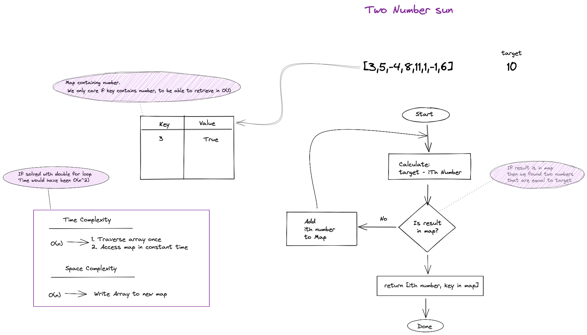

<!-- ABOUT THE PROJECT -->
## About The Project

This project contains a series of Algorithm examples.

### Built With

* [Java 16](https://www.oracle.com/java/technologies/javase-jdk16-downloads.html)
* [AlgoExpert](https://www.algoexpert.io/product)
* [Junit 5](https://junit.org/junit5/)
* [IntelliJ IDEA](https://www.jetbrains.com/idea/)

<!-- GETTING STARTED -->
## Getting Started

Clone project, review and comprehend algorithm diagram and run the unit test to see algorithm in action.

### Prerequisites

Review algorithm diagram.

<!-- ROADMAP -->
## Roadmap

## Contact

Rami Del Toro - [@rami_deltoro](https://twitter.com/rami_deltoro)

Project Link: [Algorithms Version 2](https://github.com/rami-deltoro/algorithms-v2)

## Acknowledgements

* [AlgoExpert.io](https://www.algoexpert.io)
* [Algorithms Specialization - Stanford](https://www.coursera.org/specializations/algorithms)

## Algorithms

### Two Number Sum
 

Given an array of integers nums and an integer target, return the two numbers such that they add up to target.

You may assume that each input would have exactly one solution, and you may not use the same element twice.

You can return the answer in any order.

